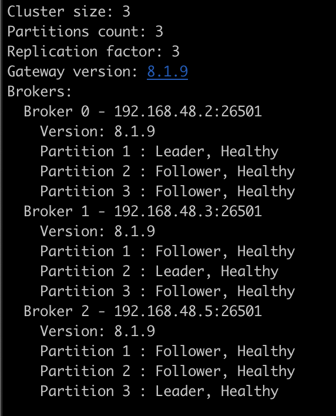

[](https://github.com/camunda-community-hub/community)
[](https://github.com/Camunda-Community-Hub/community/blob/main/extension-lifecycle.md#proof-of-concept-)[](https://opensource.org/licenses/Apache-2.0)


# Camunda 8 docker-compose profile

This is a sample docker-compose file that will deploy a Zeebe Gateway + 3 Zeebe Brokers. This is meant for demonstration
and experimentation. Additional Camunda docker-compose files can be found at [https://github.com/camunda/camunda-platform](https://github.com/camunda/camunda-platform). 

# Usage

To use this file, make sure you have [docker](https://docs.docker.com/compose/) installed. Open a terminal, `cd` into
this directory, and then run `make`

The containers will take a few minutes to start. Use `make status` to check their health as they start up. When 
the environment is fully ready, each container should report a `healthy` status. 


Verify that you can connect to the environment using `zbctl`:  

```shell
zbctl --insecure status
```



To stop and delete the containers, run this command: 

```shell
make clean
```
