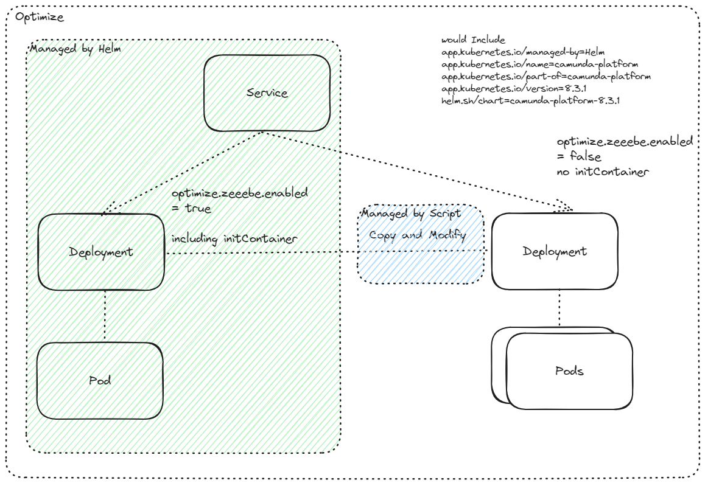

# Camunda 8 Helm Profile: High-Availability Webapps
Some components within the architecture cannot be scaled using the Helm chart due to specific limitations or requirements not covered by the chart.

There is an open issue for this topic: https://github.com/camunda/camunda-platform-helm/issues/975

Verify `yq` command line tool is installed.
yq is a command-line tool designed to manipulate and process YAML files easily.

## Webapps
The Helm chart used for this deployment manages most components efficiently. However, the following components are unable to be scaled directly using the Helm chart:
### Operate / Tasklist

Reason: Only one Importer and Archiver should be present. Can be disabled.

- Operate: `CAMUNDA_OPERATE_IMPORTERENABLED=FALSE` and `CAMUNDA_OPERATE_ARCHIVERENABLED=FALSE`
- Tasklist: `CAMUNDA_TASKLIST_IMPORTERENABLED=FALSE` and `CAMUNDA_TASKLIST_ARCHIVERENABLED=FALSE`

### Optimize

Reason: Only one Importer should be present. Can be disabled via `CAMUNDA_OPTIMIZE_ZEEBE_ENABLED=FALSE`

### Identity

Reason: Can only be scaled after the realm is initialized in Keycloak.

## Limitations and Compatibility

Copied Deployments Include Helm Labels: The copied deployments will contain Helm-related labels, even though they are not managed by Helm directly. These labels are necessary for the service to also point to the new deployment.

Compatibility: This Makefile was tested against version 8.3. 

## How to Use the Makefile:

1. **Navigate to the Repository**: Open a terminal and navigate to the root directory of this repository.
   
2. **Execute the Commands**:
   - Run `make all` to setup camunda and scale Operate,Tasklist, Optimize and Identity afterwards
   - Run `make scale-operate-webapp` to scale the Operate component.
   - Run `make scale-tasklist` to scale the Tasklist component.
   - Run `make scale-optimize` to scale the Optimize component.
   - Run `make scale-identity` to scale the Identity component.
   
3. **Optional** The following can be used in 3 partition environment to create a separate Operate Importer/Archiver for each partition: 
   - Run `make scale-operate-importer0 scale-operate-importer1 scale-operate-importer2` 

**Note**: Before executing these commands, ensure you have proper access to the Kubernetes cluster and the necessary permissions for scaling deployments.

## Sticky Sessions

When a webapp deployment (operate, optimize, or operate) has multiple replicas, each authenticated session must be
"pinned" to the same replica. Otherwise, each request will be routed to a different replica and an infinite login redirect may occur. 

See the [Makefile](./Makefile) and take a look at the target named `create-operate-ingress` to understand how to remove
an ingress rule for operate and create a separate ingress that has sticky sessions configured using cookie annotations.  

